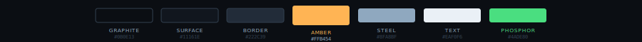

<p align="center">
  
</p>

<p align="center">
  
  
  
  
  
</p>

<p align="center">
  
</p>

<br/>

<table>
<tr>
<td width="52%" valign="top">

### Visão Geral

**Iris** é uma estação de leitura óptica de alta performance para decodificação de QR codes em tempo real via webcam. O sistema opera como um instrumento de precisão — a interface é uma metáfora direta de uma objetiva de câmera, onde o diafragma de íris comunica o estado do sistema através de animação física.

Construído inteiramente em **PyQt6** com renderização nativa, sem dependências web. Cada frame de câmera passa por um pipeline completo: detecção YOLO via ONNX Runtime → rastreamento com predição de velocidade → decodificação multi-engine com cache espacial.

</td>
<td width="48%" valign="top">

### Recursos

```
◈  Detecção por IA          YOLOv8 · ONNX Runtime CPU
◈  Rastreamento preditivo   Velocidade + ghost bbox
◈  Duo-read                 YOLO crop + crop predito
◈  Decodificação            zxing-cpp · pyzbar · cv2
◈  Feed ao vivo             30 FPS · OpenCV
◈  Linha de varredura       Animação âmbar contínua
◈  Campo de estrelas        75 partículas interativas
◈  Diafragma animado        7 lâminas · física real
◈  Histórico de leituras    Flash fósforo · timestamp
◈  Controles de câmera      Brilho · foco · exposição
◈  Modo dev (IRIS_DEVMODE)  Sem writes em banco
```

</td>
</tr>
</table>

<p align="center">
  
</p>

<br/>

## Pipeline de Detecção

O coração do sistema é um pipeline de dois workers paralelos que processa cada frame em sequência:

```
Camera frame
     │
     ▼
┌─────────────────────────────────┐
│  _TrackingWorker  (Thread 1)    │
│                                 │
│  IrisDetector (YOLO + ONNX)     │  ← YOLOv8-nano, 640×640
│       ↓                         │     blobFromImage (C++)
│  QrTracker.update()             │  ← velocidade EMA adaptativo
│       ↓                         │     dual-hypothesis matching
│  TrackedDetection[]             │     ghost bbox 10 frames ahead
└────────────┬────────────────────┘
             │  LIFO queue (frame + detecções)
             ▼
┌─────────────────────────────────┐
│  _DecodingWorker  (Thread 2)    │
│                                 │
│  QrDecoder.decode()             │  ← cache espacial TTL 0.6s
│    ├─ cache hit → retorno imediato
│    ├─ zxing-cpp  (primário)     │  ← GIL-releasing, batch API
│    ├─ pyzbar     (fallback)     │
│    ├─ cv2        (fallback)     │
│    └─ Aruco QR  (último recurso)│
│                                 │
│  Duo-read (QR em movimento)     │  ← tenta YOLO crop e crop predito
└─────────────────────────────────┘
             │
             ▼
        UI render (30 FPS)
```

**Rastreamento preditivo:** cada QR detectado tem uma velocidade EMA calculada frame a frame. Quando o QR muda de direção bruscamente, o alpha sobe para 0.85 (snap rápido); em movimento uniforme, usa 0.30 (suave). O ghost bbox magenta mostra a predição 10 frames à frente — o tracker mantém o ID mesmo quando o QR sai do frame por até 0.6s.

**Duo-read:** quando um QR está em movimento (`vel_mag > 5.0 px/s`) e ainda não foi lido, o decoder tenta também um crop centrado na posição predita para o próximo frame. Um sucesso no crop predito é pré-cacheado naquela posição, garantindo cache hit no frame seguinte.

<br/>

<p align="center">
  
</p>

<br/>

## Arquitetura de Diretórios

```
desk_Iris/
│
├── run.py                             ◈  entrypoint — python run.py
│
├── requirements.txt                   ◈  dependências Python
│
├── tools/
│   └── quantize_model.py             ◈  quantização INT8 do modelo ONNX
│                                         (1.5–3× mais rápido, ~4× menor)
│
└── app/
    └── src/
        │
        ├── UIX/                       ◈  camada de apresentação (PyQt6)
        │   ├── main.py                    app root · QApplication
        │   ├── components/
        │   │   ├── shared.py              paleta C · IrisAperture · IrisButton · IrisAppBar
        │   │   └── star_field.py          StarFieldPanel · 75 partículas · repulsão por mouse
        │   ├── main_menu/
        │   │   └── view.py                menu principal · cards animados
        │   └── modules/
        │       └── decoding/
        │           └── live_qr/
        │               └── view.py        ◈  viewfinder completo
        │                                     _TrackingWorker · _DecodingWorker
        │                                     sidebar de controles de câmera
        │                                     histórico de leituras
        │
        ├── engine/                    ◈  lógica de detecção e decodificação
        │   └── modules/
        │       └── decoding/
        │           └── live_qr/
        │               ├── detector.py    IrisDetector — YOLO via ONNX Runtime CPU
        │               ├── tracker.py     QrTracker — velocidade EMA · ghost bbox · Numba JIT
        │               ├── decoder.py     QrDecoder — cache espacial · duo-read · zxing/pyzbar/cv2
        │               ├── filter.py      enhance_for_qr — preprocessamento de imagem
        │               └── _dml_warmup.py pre-warm assíncrono do ONNX (startup)
        │
        ├── infrastructure/            ◈  adapters de hardware
        │   └── video/
        │       ├── camera.py          SingleCameraManager — callback thread-safe
        │       └── enhance.py         EdgeEnhancer — filtro de bordas opcional
        │
        ├── models/
        │   └── live_qr_yolo/
        │       └── train/weights/
        │           └── best.onnx      ◈  modelo YOLOv8-nano treinado para QR codes
        │                                 (best_int8.onnx gerado por tools/quantize_model.py)
        │
        └── services/                  ◈  serviços externos e flags de ambiente
            └── _devmode.py            IRIS_DEVMODE — suprime writes em banco
```

<br/>

<p align="center">
  
</p>

<br/>

## Paleta Visual

<p align="center">
  
</p>

<br/>

<p align="center">
  
</p>

<br/>

## Animações do Sistema

<table>
<tr>
<td width="33%" valign="top">

**Diafragma de Íris**

Simulação física de 7 lâminas. O estado do sistema é comunicado através da abertura:

```
FECHADO    openness = 0.10   idle
RESPIRANDO openness 0.15↔0.70 init
ABERTO     openness = 0.78   live
```
Easing `InOutCubic` · 650ms

</td>
<td width="33%" valign="top">

**Campo de Estrelas**

75 partículas com deriva a 35°. Interagem com o cursor dentro de 130px — linhas de constelação em âmbar aparecem ao aproximar o mouse.

```python
STAR_COUNT    = 75
DRIFT_ANGLE   = 35°
REPEL_RADIUS  = 130 px
FPS           = 60
VELOCITY_DECAY= 0.91
```

</td>
<td width="33%" valign="top">

**Linha de Varredura**

Gradiente âmbar que percorre o feed ao vivo sinalizando atividade de captura.

```
#FFB454  →  gradiente  →  #FFB454
opacity   40 px halo
step      0.004 / 16ms
reticle   4 cantos · âmbar
```

</td>
</tr>
</table>

<br/>

<p align="center">
  
</p>

<br/>

## Instalação

**Pré-requisitos:** Python 3.11+ · webcam · Windows 10/11

```bash
# 1. Clone o repositório
git clone https://github.com/Cruz-Arthur/desk_Iris.git
cd desk_Iris

# 2. Crie e ative o ambiente virtual (recomendado)
python -m venv .venv
.venv\Scripts\activate

# 3. Instale as dependências
pip install -r requirements.txt

# 4. Execute
python run.py
```

**Modo desenvolvimento** — suprime todos os writes em banco:

```bash
set IRIS_DEVMODE=1 && python run.py
```

**Quantização INT8** — opcional, acelera inferência YOLO em 1.5–3×:

```bash
python tools/quantize_model.py
# gera app/src/models/live_qr_yolo/train/weights/best_int8.onnx
```

<br/>

<p align="center">
  
</p>

<br/>

## Semântica de Cores

| Cor | Hex | Significado |
|-----|-----|-------------|
|  Âmbar Óptico | `#FFB454` | Sistema ativo · interação · foco |
|  Fósforo Verde | `#4ADE80` | QR decodificado com sucesso |
|  Magenta Elétrico | `#FF3C88` | Ghost bbox — predição de velocidade |
|  Alerta | `#FF7A7A` | Fechamento · avisos |
|  Aço | `#8FA8BF` | Texto secundário · labels técnicos |
|  Grafite Profundo | `#0B0E13` | Fundo principal |
|  Off-White | `#EAF0F6` | Texto principal |

<br/>

<p align="center">
  
</p>

<br/>

<p align="center">
  <sub>
    <code>IRIS · SYSTEMS</code> &nbsp;·&nbsp; Estação de Leitura Óptica &nbsp;·&nbsp; PyQt6 · OpenCV · ONNX
  </sub>
</p>
